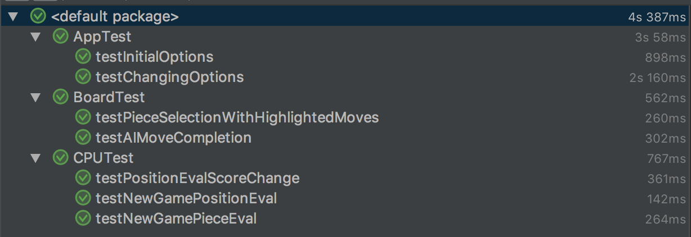

# Test Plan

## Test Cases 

* Varying A.I difficulty levels should be available from the main menu

* Single player mode should be available for selection

* Two player mode should be available for selection

* Input from the mouse should work

* Images from the chess pieces should show

* Griffin Chess should have an **Options** menu and a **New Game** option on the starting screen

* **Option** menu should provide buttons that allow the user to customize the games appearance, the type of opponent, and the difficulty

* When the **New Game** button is clicked, a new game of game chess should begin, with the options the user has selected

* By default, a new game should be set against an AI-controlled opponent at a "normal" difficulty setting

* Once a game has begun, Griffin Chess should display a top down view of a chess board with all of the pieces on it, similar to the prototype below

* On a users turn, Griffin Chess should allow pieces to be selected by clicking on the piece directly on the chess board

* When a piece is selected, the square of the board containing it should become highlighted

* When a piece is selected, the available destinations for that piece should also become highlighted with a different color, and Griffin Chess shall allow players to click on a highlighted square to select it as their move

* Griffin Chess should indicate a move has been selected by highlighting a chosen square with a third color, as seen in the prototype image below

* If a chosen move contains an opposing players piece, a separate color should be used to highlight the square, indication that it can be captured

* Griffin Chess should provide a Confirm button that when clicked, shall accept a players move and advance the game to the next players turn

* If a player takes a move that captures an opposing players piece, that piece should be removed from the board

* If a new piece belonging to the current player is clicked on instead, Griffin Chess should display the available destinations for that piece, and repeat the process

* If an invalid square is clicked, Griffin Chess should un-highlight and deselect all squares

* Griffin Chess should impose no time limit on the length of a players turn

* Griffin Chess should continue to alternate control of the game between the two players until one forfeits or checkmate is achieved, which shall be detected automatically

* Griffin Chess should display a message at the end of a game summarizing the results

* When a piece is selected, all of the possible moves should be shown to the user

## Test Plan Output/Analysis

* As seen above, we implemented our Test Plan with JUnit 4 unit tests.
* All of our tested features are passing which matches what we've observed during play tests.

### `AppTest`

* `testInitialOptions` creates a new `App` and tests it's initial game options against the expected settings.
* `testChangingOptions` changes some setting values and makes sure the correct changes are reflected in the app state.

### `BoardTest`

* `testPieceSelectionWithHighlightedMoves` manually selects a piece on the designated "Human" side of the board and checks the board state to ensure the selected piece is highlighted, as well as the available moves for the piece.
  * positive and negative tests were used here to ensure that no other pieces were incorrectly highlighted or identified as potential moves.
* `testAIMoveCompletion` checks the initial board state of a new game, and compares this with the state of the board after an AI player has taken a turn.
  * Since the state of the board changes, we know our AI player is able to take moves on their own.

### `CPUTest`

* `testPositionEvalScoreChange` checks to make sure that after 2 AI moves, the evaluation of the board state has changed.
  * Ideally, the evaluation score will have improved, but in this test we settled for any score change.
* `testNewGamePositionEval` tests the "Position" evaluation of a newly created chess board.
  * Because we want our AI player to be motivated to move, we should not get a value of zero for our initial board evaluation here.
* `testNewGamePieceEval` tests the "Piece" evaluation of a newly created chess board.
  * Because the Piece score for both players should be equal before anything has been captured or removed from the board, we expect the score to equal zero in this test.

## Design Shortcomings
* When implementing the test plan, it was apparent that our design could have benefitted from a more "functional" approach.
  * Relying on mutated objects and "void" functions meant that we were not able to easily output the state of the board to our Unit Tests.
  * Given more time, we could restructure our AI move-generating methods and boardState updates to utilize pure functions to further protect against accidental state changes and allow for higher code coverage on our unit tests.
* Private methods are good for Encapsulation, and for avoiding mutation errors, but they did not make our test plan easy to implement. Several public "getter" methods had to be added in order to fully test our AI algorithms.