## 1. Introduction

### 1.1 Purpose
This document contains the system design description for the Griffin Chess App. Included are the Architectural design and features of the MVC classes, interactions and details of how each class performs. This document will also show how the use cases that were detailed in the SRS are to be implemented using this design pattern.
Primary audiences for this document are the software developers. 

### 1.2 System Overview
Griffin Chess shall be written in Java following the Model-View-Controller pattern. This will enable us to seperate the internal state of the application from the classes that present that information and interact with the user. Griffin Chess shall take advantage of various design paterns including iterators and The Observer/Observable pattern. Interfaces and abstract classes will be utilized to maximize code reuse and streamline the development process with a distributed team.

### 1.3 Definitions, Acronyms and Abbreviations
|Term | Definition|
|:-------|:---------:|
|A.I.|The algorithm that will play a chess game against the human player.|
|A.I. Difficulty|The created sense of increased/decreased difficulty from the A.I.’s algorithm which chooses the best possible move.|                      
|Available moves|The possible moving patterns and destination cells of a specific chess piece.| 
|Draw|If both player 1 and player 2 reach a stalemate without any way for either to achieve a winning condition.|
|Check|The condition when a player’s king is under threat of capture in the opponent’s next turn.|
|Checkmate|When the player cannot move out of check. The player on checkmate loses and the game ends.|
|Chess Board|The 8x8 plane where the chess pieces reside, and where they can be moved.|
|Chess Piece|The items that are used by each player to play chess against the opponent.|
|Player|The user/A.I. that moves the pieces on the board to play the game.|

### 1.4 Supporting Materials
1. FIDE Laws of Chess
  * www.fide.com/component/handbook/?id=124&view=article
2. Guide to building a simple chess A.I.by Lauri Hartikka, March 30, 2017.
  * https://medium.freecodecamp.org/simple-chess-ai-step-by-step-1d55a9266977
3. Software Engineering by Sommerville, 10th Ed. - Chapter 6 Architectural Design
  * MVC Diagram featured in Section 2.1
  
  

### 1.5 Document Overview
Section 1 contains an outline of the structure of this document, as well as a glossary of terms and list of references used.

Section 2 contains diagrams displaying the MVC architecture of Griffin Chess, as well as the makeup and relationship between the different classes that make up the application.

Section 3 contains a high-level overview of the different states of Griffin Chess and the flow of data between the view and the managed state of the board.

Section 4 contains several Use Cases that represent the most vital functions of Griffin Chess and shows how the user will progress through them and perform each action.

## 2. Classes and Components

### 2.1 Overview

The following diagram (from Reference Source #3) shows a basic Model-View-Controller Architecture, which shall serve as an outline for the structure of Griffin Chess.

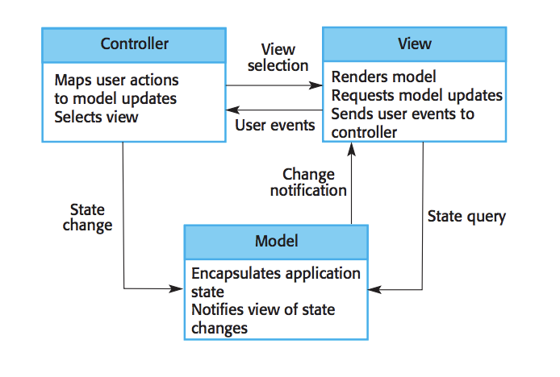

While Griffin Chess shall interact with the user through the GUI front end, the core mechanics and game data will be managed by a loosely coupled back-end, following the traditional Model-View-Controller pattern pictured above in the example. The game state, logic, and user interactions will be kept separate from the classes that display them, which will allow us to offer users different display options in the future and will allow the teams to write more maintainable, encapsulated code.

### 2.2.1 `App` Class 
_<Describe an element (subsystem, component, etc...) from architecture in further detail. When appropriate, include information on how the element is further broken down and the interactions and relationships between these subcomponents.>_

The `App` class acts as the Model in the MVC architecture and maintains the currently selected options.

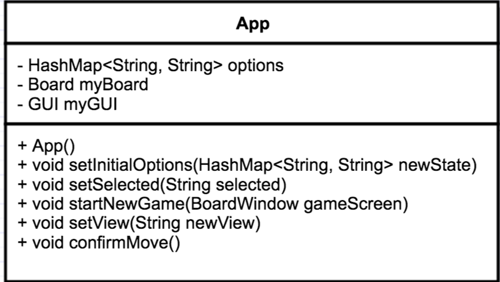

### 2.2.2 `Board` Class

The `Board` class maintains the state of the board and the location. The Board class extends the Observable class in order to take advantage of the Observer/Observable pattern and keeps its observers constantly updated with the most current version of the board.

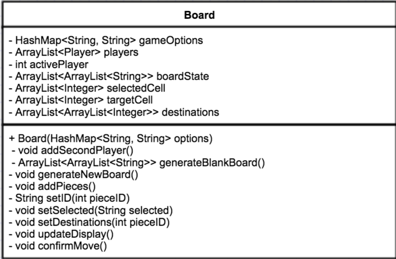

### 2.2.3 `aPiece` Class

The abstract `aPiece` class contains the implementation of functions that are relevant to all pieces.

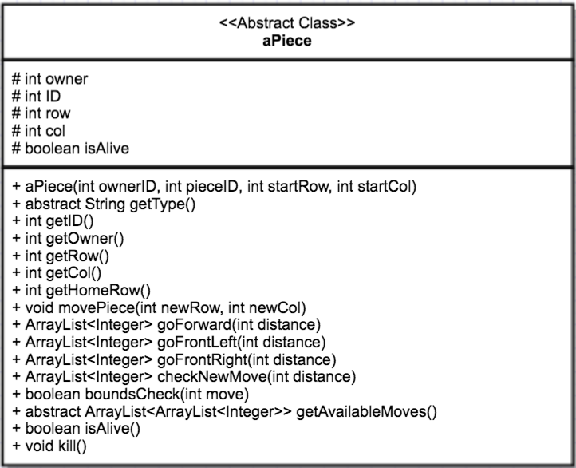

### 2.2.4 `Pawn` Class

The `Pawn` extends the `aPiece` class and initializes individual pawn pieces and provides functions for the characteristics of the pawn.

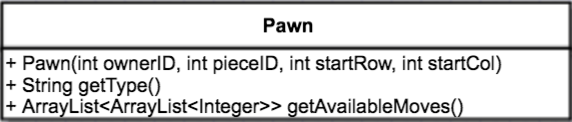

### 2.2.5 `Piece` Interface

The `Piece` interface provides function declarations that are relevant to all pieces.

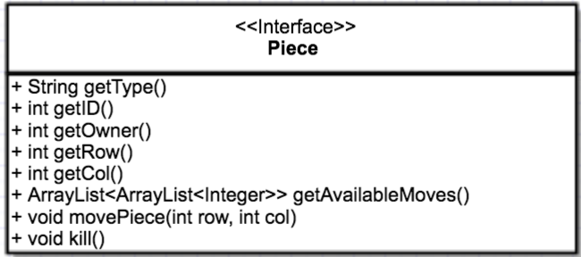

### 2.2.6 `Human` Class

The `Human` class implements `Player` and creates a player and initializes the pieces.

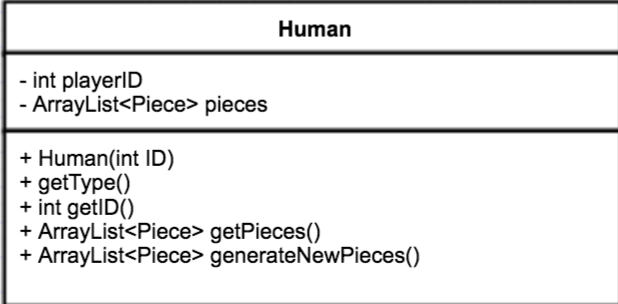

### 2.2.7 `Player` Interface

The `Player` interface provides function declarations that are relevant to all players.

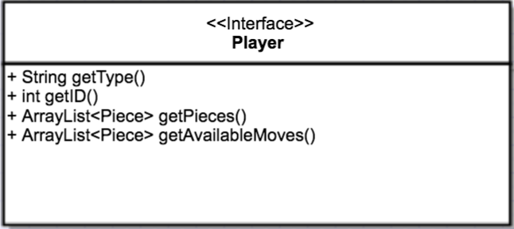

### 2.2.8 `Cell` Class

The `Cell` class extends `JButton` and initializes the characteristics of each cell on the chess board and specifies colors for the varying moves of the chess pieces and the natural color of the cells of the board.

### 2.2.9 `GUI` Class

The `GUI` class instantiates the View and graphics.

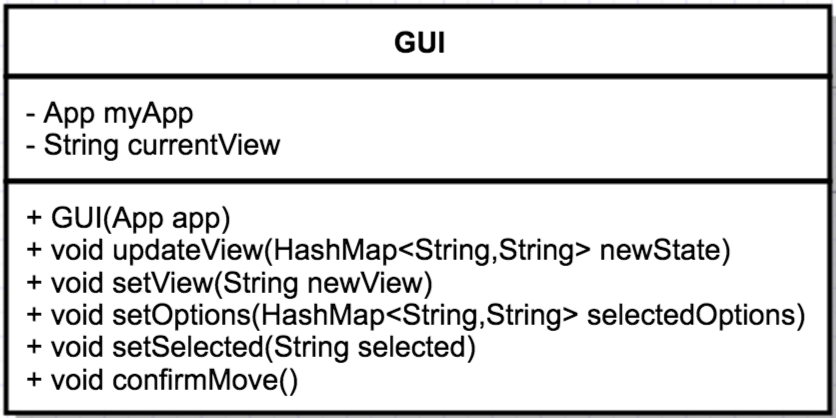

### 2.2.10 `aWindow` Class

The `aWindow` class provides characteristics and functions that are common to all unique windows.

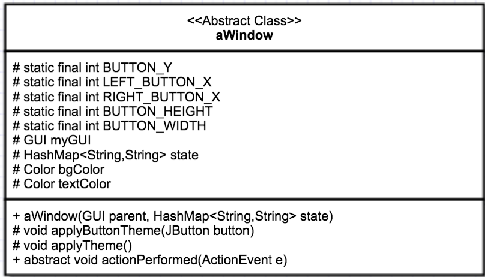

### 2.2.11 `BoardWindow` Class

The `BoardWindow` extends the `aWindow` class and provides characteristics and functions unique to the board.

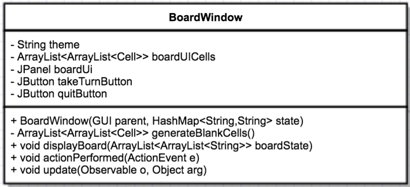

### 2.2.12 `MenuWindow` Class 

The `MenuWindow` extends the `aWindow` class and provides characteristics and functions unique to the menu.

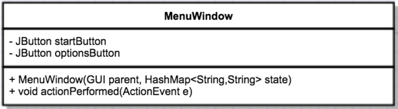

### 2.2.13 `OptionsWindows` Class

The `OptionsWindow` class extends `aWindow` and provides characteristics and functions unique to the options.

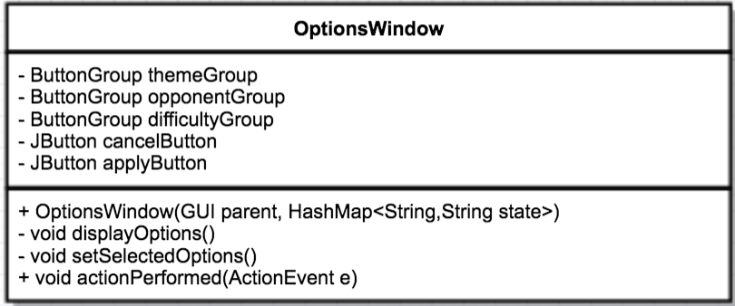

## 3. High-Level Design

Griffin Chess shall accept input from the user through mouse clicks on buttons in the menus, and on cells of the chess board during the game. The following sequence diagram shows how input shall be handled by the View components and the flow of data back to the Model. From there, the Observable `Board` class shall update the View directly with the newest version of the board state, which then highlights its cells accordingly

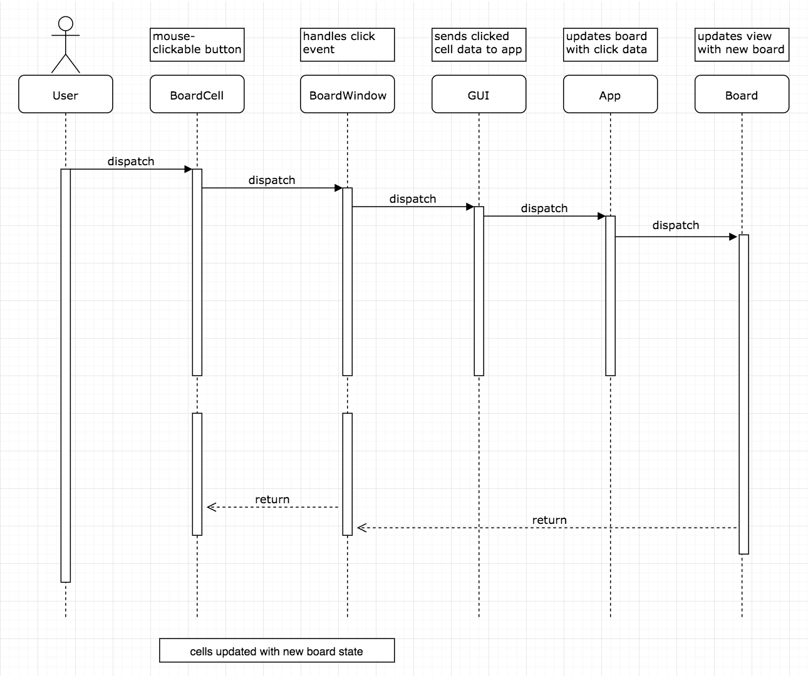

The user opens the Griffin Chess application and an initial start screen is shown. The user has the choice to start the game or change certain options to the preferences of the user. The user can change display options, whether the opponent should be another person or the AI, varying difficulties for the AI, and can cancel changes or apply those changes to the game. If the user chooses to start the game, the chess board and pieces are generated and the user can play the game. When the user moves a piece, the move is confirmed by the user and the piece moves to an available space until the game ends by checkmate or stalemate. The user can also quit in the middle of the game at any time.

### 3.1 View / Model Components
_<Provide a description and diagrams of a system component or set of components that describes a clearly defined view or model of the entire system or a subset of the system.>_

## 4. Use Cases
The Use case diagrams give an representation of the most significant scernarios that the player may use. 
### 4.1 Start Game/Options

Preconditions: None 

Main Flow: As Griffin Chess is opened, the player has the choice to start the game immediately. The second choice is the option menu to prompt the user with difficulty level, opponent, and Day/Night mode. 

### 4.2 Move Pieces

Preconditions: During the use of the game.

Main Flow: The player with the current turn has the option to move the selected piece. 

### 4.3 Choosing of A.I opponent

Preconditions: During the use of the game.

Main Flow: The player chooses the A.I as an opponent, starts the game, and while in the game has the option to move the selected piece or quit the game. 

### 4.4 Player vs Player 

Preconditions: None.

Main Flow: Player one initiates the start of the game. Depending if player one has chosen a Player 2 opponent or the A.I, joins the game. During the current players turn, the select piece and move piece options are available which then can lead to the winning of the game. If player two is in the game state with player 1 both can quit game if desired. 

## 5. Test Plan

### 5.1 Test Cases 

* Varying A.I difficulty levels should be available from the main menu

* Single player mode should be available for selection

* Two player mode should be available for selection

* Input from the mouse should work

* Images from the chess pieces should show

* Griffin Chess should have an **Options** menu and a **New Game** option on the starting screen

* **Option** menu should provide buttons that allow the user to customize the games appearance, the type of opponent, and the difficulty

* When the **New Game** button is clicked, a new game of game chess should begin, with the options the user has selected

* By default, a new game should be set against an AI-controlled opponent at a "normal" difficulty setting

* Once a game has begun, Griffin Chess should display a top down view of a chess board with all of the pieces on it, similar to the prototype below

* On a users turn, Griffin Chess should allow pieces to be selected by clicking on the piece directly on the chess board

* When a piece is selected, the square of the board containing it should become highlighted

* When a piece is selected, the available destinations for that piece should also become highlighted with a different color, and Griffin Chess shall allow players to click on a highlighted square to select it as their move

* Griffin Chess should indicate a move has been selected by highlighting a chosen square with a third color, as seen in the prototype image below

* If a chosen move contains an opposing players piece, a separate color should be used to highlight the square, indication that it can be captured

* Griffin Chess should provide a Confirm button that when clicked, shall accept a players move and advance the game to the next players turn

* If a player takes a move that captures an opposing players piece, that piece should be removed from the board

* If a new piece belonging to the current player is clicked on instead, Griffin Chess should display the available destinations for that piece, and repeat the process

* If an invalid square is clicked, Griffin Chess should un-highlight and deselect all squares

* Griffin Chess should impose no time limit on the length of a players turn

* Griffin Chess should continue to alternate control of the game between the two players until one forfeits or checkmate is achieved, which shall be detected automatically

* Griffin Chess should display a message at the end of a game summarizing the results

* When a piece is selected, all of the possible moves should be shown to the user
