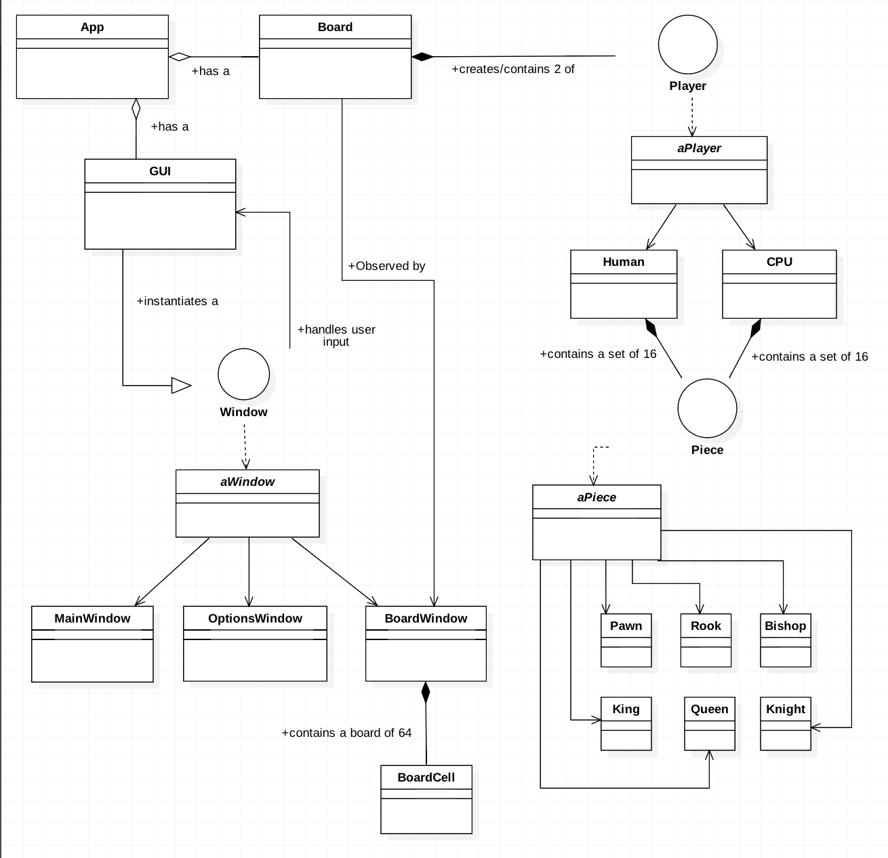
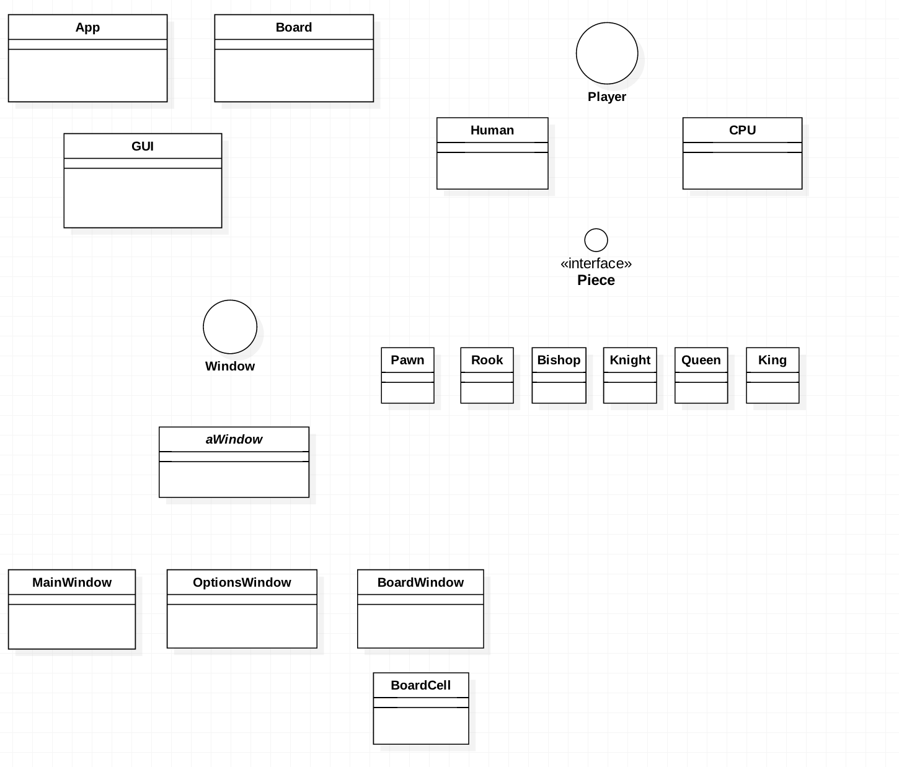
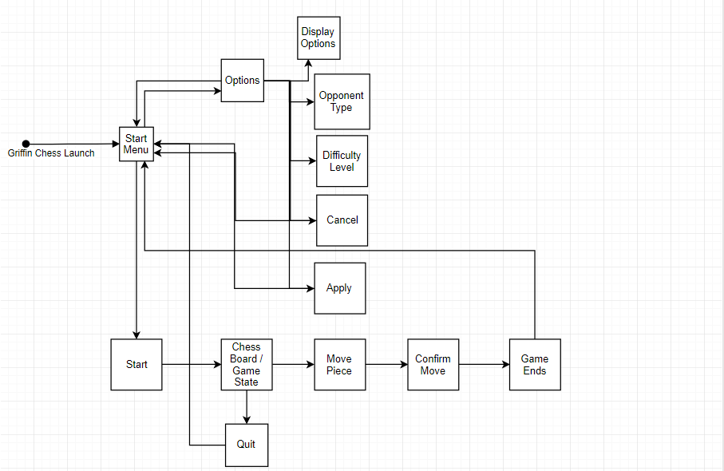
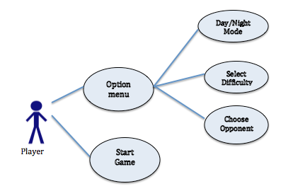
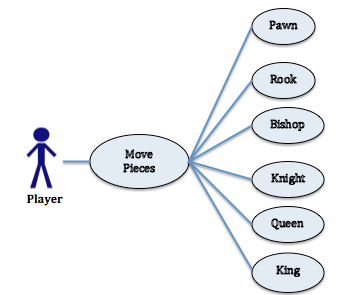
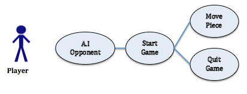
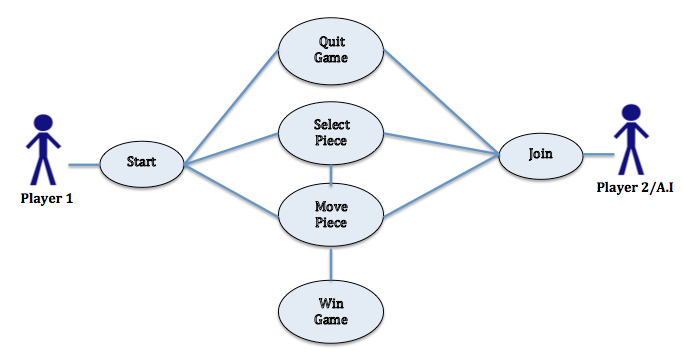

## 1. Introduction

### 1.1 Purpose
This document contains the system design description for the Griffin Chess App. Included are the Architectural design and features of the MVC classes, interactions and details of how each class performs. This document will also show how the use cases that were detailed in the SRS are to be implemented using this design pattern.
Primary audiences for this document are the software developers. 

### 1.2 System Overview
Griffin Chess will be written in Java following the Model-View-Controller pattern. This will enable us to seperate the internal state of the application from the class that present that information and interact with the user. The code will take advantage of various design paterns including [LIST DESIGN PATTERNS HERE]. Interfaces and abstract classes will be used to maximize code reuse and streamline the development process.

### 1.3 Definitions, Acronyms and Abbreviations
_<List any project definitions and acronyms introduced to the project by this design.>_
  
|Term | Definition|
|:-------|:---------:|
|A.I.|The algorithm that will play a chess game against the human player.|
|A.I. Difficulty|The created sense of increased/decreased difficulty from the A.I.’s algorithm which chooses the best possible move.|                      
|Available moves|The possible moving patterns and destination cells of a specific chess piece.| 
|Draw|If both player 1 and player 2 reach a stalemate without any way for either to achieve a winning condition.|
|Check|The condition when a player’s king is under threat of capture in the opponent’s next turn.|
|Checkmate|When the player cannot move out of check. The player on checkmate loses and the game ends.|
|Chess Board|The 8x8 plane where the chess pieces reside, and where they can be moved.|
|Chess Piece|The items that are used by each player to play chess against the opponent.|
|Player|The user/A.I. that moves the pieces on the board to play the game.|

### 1.4 Supporting Materials
* FIDE Laws of Chess
  * www.fide.com/component/handbook/?id=124&view=article
* Guide to building a simple chess A.I.by Lauri Hartikka, March 30, 2017.
  * https://medium.freecodecamp.org/simple-chess-ai-step-by-step-1d55a9266977
* Software Engineering by Sommerville, 10th Ed. - Chapter 5 System Modeling
  * MVC Diagram from the book goes here... serves as an outline for the structure of our app
  

### 1.5 Document Overview
>in progress>

Chapter 2 shows the architecture of the program through its various states, and the overall chosen design pattern. The interactions and functions of each elememnt/component/subsystem is detailed down for a broader understanding of the chosen design pattern.

Chapter 3 In this chapter the design patter is broken down into its major elements to provide a high-level view of its functions.

## 2. Classes and Components

### 2.1 Overview

While the user will interact with the game through the GUI front end, the core mechanics will be operating in a loosely coupled back-end and will follow a Model-View-Controller pattern. The game state, logic, and user interactions will be kept separate from the classes that display them, which will allow us to offer users different display options in the future and will allow the teams to write more maintainable, encapsulated code.

### 2.2 `App` Component 
_<Describe an element (subsystem, component, etc...) from architecture in further detail. When appropriate, include information on how the element is further broken down and the interactions and relationships between these subcomponents.>_

## 3. High-Level Design
* **diagram of model/view interactivity (or something) here**

The user opens the Griffin Chess application and an initial start screen is shown. The user has the choice to start the game or change certain options to the preferences of the user. The user can change display options, whether the opponent should be another person or the CPU, varying difficulties for the AI, and can cancel changes or apply those changes to the game. If the user chooses to start the game, the chess board and pieces are generated and the user can play the game. When the user moves a piece, the move is confirmed by the user and the piece moves to an available space until the game ends by checkmate or stalemate. The user can also quit in the middle of the game at any time.

### 3.1 View / Model Component 1..n
_<Provide a description and diagrams of a system component or set of components that describes a clearly defined view or model of the entire system or a subset of the system.>_

## 4. Use Cases

### 4.1 Use-Case 1

* description

### 4.2 Use-Case 2

* description

### 4.3 Use-Case 3

* description

### 4.4 Use-Case 4

* description