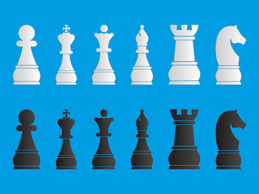
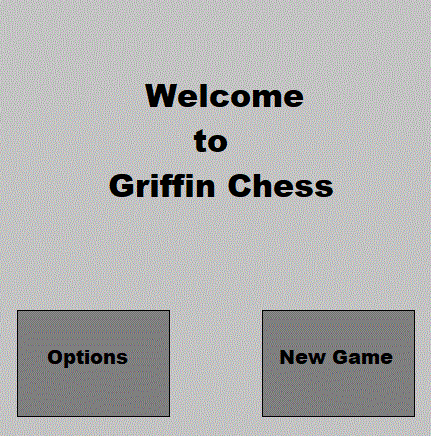
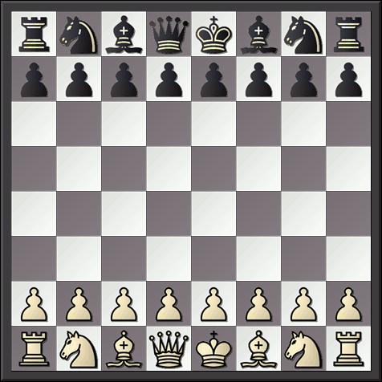
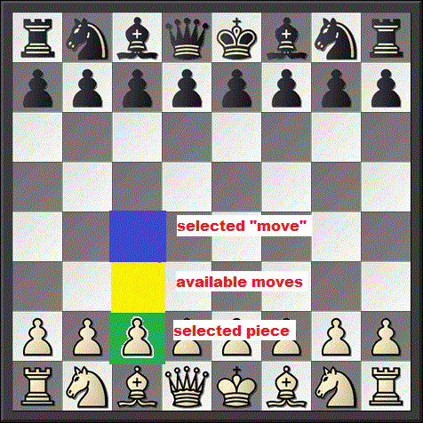
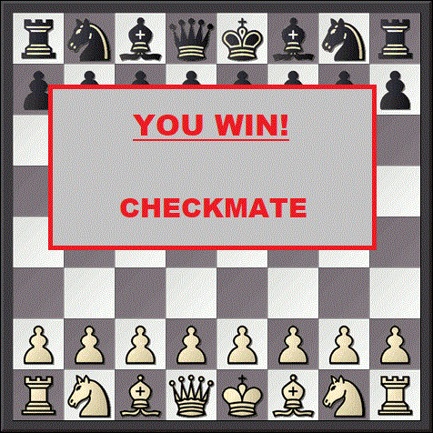
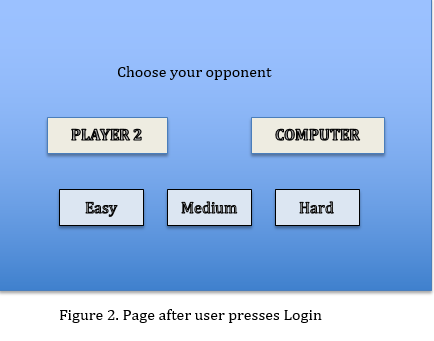
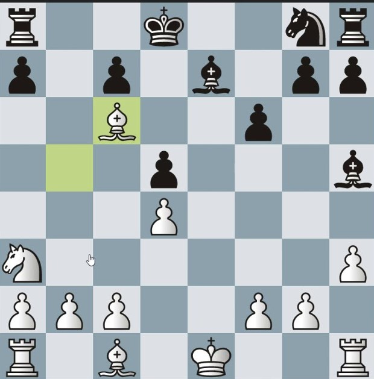
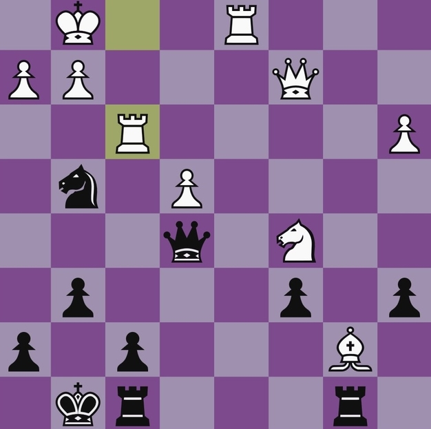

## 1. Introduction

### 1.1 Purpose 
The purpose of this document is to provide a detailed requirements overview for the Griffin Chess application. It will also explain the purpose and features. Griffin Chess shall provide the user with a reliable, well designed chess game. The version of this product is 1.0 and this SRS shall cover the full scope of Griffin Chess.

### 1.2 Definitions, Acronyms and Abbreviations
|Term | Definition|
|:-------|:---------:|
|GC|Griffin Chess|
|IDE|Integrated Development Environment|                      
|JRE|Java Runtime Environment| 

### 1.3 Product Scope
Griffin Chess is developed entirely in Java and can be launched on a system that supports the JRE. This entire project will be available on GitHub.

### 1.4 References
“Laws of Chess: For competitions starting before 1 July 2014.” World Chess Federation - FIDE, www.fide.com/component/handbook/?id=124&view=article.

## 2. Overall Description

### 2.1 Product Perspective

Griffin Chess is a java based stand alone application for a Chess game. Griffin Chess shall provide a simple mechanism for users to play against an opponent in a game of chess.
The following are the main features that shall be included in the game: 
   1/2 player - The game shall provide the options to play against an A.I., or a second player. 
   Difficulty - Varying A.I. difficulty settings shall be available. 
   Tips/How to play - A section that shall include an explanation of the basic rules of chess, along with some tips to get the user started.

### 2.2 Product Functions

The following options shall be available in a starting menu:  
Single player -> Start a game of chess against a computer: Difficulty selection shall be available here 
Two-player (if it's one of the features we'll implement) -> Start a game of chess with two players 
Night/Day mode -> This option shall change the color layout of the board 
Tips/How to play -> display a list of tips/how-to-play manual

### 2.3 User Classes and Characteristics

The expected user shall be anyone with access to a computer which can run the JRE. There are no privilege levels/educational level/expertise nor experience required. The user is not expected to know Chess, as the rules and tips/strategies shall be included in the application.

### 2.4 Operating Environment

This shall be a Java based application, so the user must have JRE 1.8.0_161.

### 2.5 User Documentation

The Chess rules shall be included within Griffin Chess, along with some initial basic tips to give the user a good idea on how to start playing chess. 
(Aside, in case there are any bugs that were not able to be fixed at time of product delivery, perhaps to include and list of possible workarounds?)

### 2.6 Assumptions and Dependencies
Since this will be a standalone application, there shall not be any other dependencies aside the requirement of having the Java environment installed in the computer. 

## 3. External Interface Requirements

### 3.1 User Interfaces

* Griffin Chess shall provide a full-color graphical user interface (GUI) and take input from the mouse. 

* Images for the chess pieces themselves shall be sourced from a royalty-free provider and follow a tranditional theme, as in the example below.

* From the title screen, Griffin Chess shall offer the choice of going to the **Options** menu or starting a **New Game** by clicking on the appropriate button, similar to the ones seen in this sample design.

* On the **Options** menu, Griffin Chess shall provide buttons that allow users to customize the games appearence, the type of opponent, and the difficulty (these features are described in detail in Section 4).

* When the **New Game** button is clicked, a new game of chess shall begin, with the options the user has selected.

* By defualt, a new game shall be set against an AI-controlled opponent at a "normal" difficulty setting.

* Once a game has begun, Griffin Chess shall display a top down view of a chess board with all of the pieces on it, similar to the prototype below.

 

* On a user's turn, Griffin Chess shall allow pieces to be selected by clicking on the piece directly on the chess board.

* When a piece is selected, the square of the board containing it shall become highlighted.

* When a piece is selected, the available destinations for that piece shall also become highlighted with a different color, and Griffin Chess shall allow players to click on a highlighted square to select it as their move.

* Griffin Chess shall indicate a move has been selected by highlighting a chosen square with a third color, as seen in the prototype image below.

* If a chosen move contains an oppsing player's piece, a seperate color shall be used to highlight the square, indication that it can be captured.

* Griffin Chess shall provide a **Confirm** button that, when clicked, shall accept a players move and advance the game to the next players turn.

* If a player takes a move that captures an opposing players piece, that piece shall be removed from the board.

* If a new piece belonging to the current player is clicked on instead, Griffin Chess shall display the available destinations for that piece, and repeat the process.

* If an invalid square is clicked, Griffin Chess shall un-highlight and deselect all squares.

* Griffin Chess shall impose no time limit on the length of a player's turn.

* Griffin Chess shall continue to alternate control of the game between the two players until one forfeits or checkmate is acheived, which shall be detected automatically.

* Griffin Chess shall display a message at the end of a game summarizing the results.

### 3.2 Hardware Interfaces
Griffin Chess shall require no specific hardware other than a mouse for input, a monitor to display the game, and a computer than can support the JRE, which is needed to run the game files.

## 4. System Features

### 4.1 Greeting User Interface

4.1.1 Description
The interface shall provide an option button for a second player or computer opponent after the first user name is created. The game of chess shall consist of two different players in the game. 
   1. Player / Guest 
   2. Computer A.I 

### 4.2 Difficulty level 
4.2.1 Description
The greeting interface shall allow the user to change the difficulty level of the A.I opponent. In figure 2, this shows there shall be three levels of difficulty: easy, medium, and hard. The default level shall be easy. Hard difficulty shall maximize the A.I. efficiency to win the game.  

### 4.3 Day/Night Mode
4.3.1 Description

The overall U.I theme shall be able to change for the comfort of the user due to eyestrain. The default theme when Griffin Chess opens shall be the day mode U.I. The colors for day mode shall be visibly brighter for use in bright conditions. Night mode changes the U.I colors to visibly darker colors to decrease the chance of eyestrain. As mentioned in Section 3.1, the user should have the option to toggle between either day or night mode while in progress of the game by clicking the option menu button. 

Figure 3. Day mode feature. 

Figure 4. Night mode feature. 

### 4.5 Interactive Game Moves
4.5.1 Description
The user shall be shown the possible move outcomes with the piece that is chosen. The integrated A.I should help with the outcomes regardless if there is a human or A.I opponent. The U.I shall display a notification on the board to interact with the user. If a move has the outcome of a piece capture, the U.I shall display a ‘X’ over the piece that will be captured.

## 5. Other Nonfunctional Requirements

### 5.1 Performance Requirements  
Griffin Chess shall not crash. Other than that, there are not any specific performance requirements. The time complexity and space complexity have not been specified. The overall goal shall be to get the program running without any bugs or user-related problems.

### 5.2 Safety Requirements  
There are no safety requirements.

### 5.3 Security Requirements  
There are no security requirements. Griffin Chess has no database, no user information, or any private information that could be used to compromise an individual.

### 5.4 Software Quality Attributes  
Griffin Chess shall run smoothly and give the user a somewhat enjoyable experience playing chess at a basic level.

### 5.5 Business Rules  
There are no business rules.
