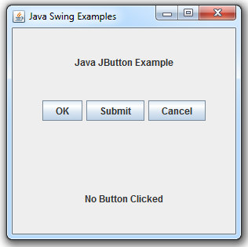

## 1. Introduction

### 1.1 Purpose 
_<Identify the product whose software requirements are specified in this document, including the revision or release number. Describe the scope of the product that is covered by this SRS, particularly if this SRS describes only part of the system or a single subsystem.>_

### 1.2 Document Conventions
_<Describe any standards or typographical conventions that were followed when writing this SRS, such as fonts or highlighting that have special significance. For example, state whether priorities  for higher-level requirements are assumed to be inherited by detailed requirements, or whether every requirement statement is to have its own priority.>_

### 1.3 Intended Audience and Reading Suggestions
_<Describe the different types of reader that the document is intended for, such as developers, project managers, marketing staff, users, testers, and documentation writers. Describe what the rest of this SRS contains and how it is organized. Suggest a sequence for reading the document, beginning with the overview sections and proceeding through the sections that are most pertinent to each reader type.>_

### 1.4 Product Scope
_<Provide a short description of the software being specified and its purpose, including relevant benefits, objectives, and goals. Relate the software to corporate goals or business strategies. If a separate vision and scope document is available, refer to it rather than duplicating its contents here.>_

### 1.5 References
_<List any other documents or Web addresses to which this SRS refers. These may include user interface style guides, contracts, standards, system requirements specifications, use case documents, or a vision and scope document. Provide enough information so that the reader could access a copy of each reference, including title, author, version number, date, and source or location.>_

## 2. Overall Description

### 2.1 Product Perspective
_<Describe the context and origin of the product being specified in this SRS. For example, state whether this product is a follow-on member of a product family, a replacement for certain existing systems, or a new, self-contained product. If the SRS defines a component of a larger system, relate the requirements of the larger system to the functionality of this software and identify interfaces between the two. A simple diagram that shows the major components of the overall system, subsystem interconnections, and external interfaces can be helpful.>_

### 2.2 Product Functions
_<Summarize the major functions the product must perform or must let the user perform. Details will be provided in Section 3, so only a high level summary (such as a bullet list) is needed here. Organize the functions to make them understandable to any reader of the SRS. A picture of the major groups of related requirements and how they relate, such as a top level data flow diagram or object class diagram, is often effective.>_

### 2.3 User Classes and Characteristics
_<Identify the various user classes that you anticipate will use this product. User classes may be differentiated based on frequency of use, subset of product functions used, technical expertise, security or privilege levels, educational level, or experience. Describe the pertinent characteristics of each user class. Certain requirements may pertain only to certain user classes. Distinguish the most important user classes for this product from those who are less important to satisfy.>_

### 2.4 Operating Environment
_<Describe the environment in which the software will operate, including the hardware platform, operating system and versions, and any other software components or applications with which it must peacefully coexist.>_

### 2.5 Design and Implementation Constraints
_<Describe any items or issues that will limit the options available to the developers. These might include: corporate or regulatory policies; hardware limitations (timing requirements, memory requirements); interfaces to other applications; specific technologies, tools, and databases to be used; parallel operations; language requirements; communications protocols; security considerations; design conventions or programming standards (for example, if the customer’s organization will be responsible for maintaining the delivered software).>_

### 2.6 User Documentation
_<List the user documentation components (such as user manuals, on-line help, and tutorials) that will be delivered along with the software. Identify any known user documentation delivery formats or standards.>_

### 2.7 Assumptions and Dependencies
_<List any assumed factors (as opposed to known facts) that could affect the requirements stated in the SRS. These could include third-party or commercial components that you plan to use, issues around the development or operating environment, or constraints. The project could be affected if these assumptions are incorrect, are not shared, or change. Also identify any dependencies the project has on external factors, such as software components that you intend to reuse from another project, unless they are already documented elsewhere (for example, in the vision and scope document or the project plan).>_

## 3. External Interface Requirements

### 3.1 User Interfaces
The game will provide users with a graphical interface (GUI) and will be controlled via the mouse and keyboard. The graphical elements will be built upon the components provided by the Java Swing framework. The game graphics will be created using Swing and the chess pieces will be based on vector images provided by _uidownload.com_.

Using the mouse, users will be able to navigate the game's main menu and adjust settings by clicking on a variety of buttons, like the ones **pictured below**. The user can begin a new game of chess by clicking on the "Start Game" button.

Once a game has begun, the user will be shown a top down view of a chessboard with all of the pieces on it. On their turn a user can select a piece by clicking on it, which will cause it to become highlighted. Once a piece has been selected the user can click on a space to select it as a target/destination. If this space can be reached through a valid move, the square on the board will become highlighted, and a "Confirm" button will become enabled. If the user confirms their move, an animation will be displayed of the piece moving to its new location, overtaking any pieces that might currently occupy that space. The other player, whether computer or human, will take their move, and the two players will continue until one wins or forfeits. A screen will be displayed at the end of the game, summarizing the match.

### 3.2 Hardware Interfaces
Since our game will be written in Java, which is executed in a virtual machine, we will not need to interface directly with any hardware. Any type of hardware that is able to run and support the JVM should be able to run the executable JAR files for this game.

### 3.3 Software Interfaces
While the user will interact with the game through the GUI front end, the core mechanics will be operating in a loosely coupled back-end and will follow a Model-View-Controller pattern. The game state, logic, and user interactions will be kept seperate from the classes that display them, which will allow us to offer users different display options in the future and will allow the teams to write more maintainable, encapsulated code.

## 4. System Features
_<This template illustrates organizing the functional requirements for the product by system features, the major services provided by the product. You may prefer to organize this section by use case, mode of operation, user class, object class, functional hierarchy, or combinations of these, whatever makes the most logical sense for your product.>_

### 4.1 System Feature 1
**<Don’t really say “System Feature 1.” State the feature name in just a few words.>**  

4.1.1	Description and Priority  
_<Provide a short description of the feature and indicate whether it is of High, Medium, or Low priority. You could also include specific priority component ratings, such as benefit, penalty, cost, and risk (each rated on a relative scale from a low of 1 to a high of 9).>_  

4.1.2	Stimulus/Response Sequences  
_<List the sequences of user actions and system responses that stimulate the behavior defined for this feature. These will correspond to the dialog elements associated with use cases.>_  

4.1.3	Functional Requirements  
_<Itemize the detailed functional requirements associated with this feature. These are the software capabilities that must be present in order for the user to carry out the services provided by the feature, or to execute the use case. Include how the product should respond to anticipated error conditions or invalid inputs. Requirements should be concise, complete, unambiguous, verifiable, and necessary. Use “TBD” as a placeholder to indicate when necessary information is not yet available.>_

**<Each requirement should be uniquely identified with a sequence number or a meaningful tag of some kind.>**  

  REQ-1:  
  REQ-2:  
### 4.2 System Feature 2 (and so on)

## 5. Other Nonfunctional Requirements

### 5.1 Performance Requirements  
_<If there are performance requirements for the product under various circumstances, state them here and explain their rationale, to help the developers understand the intent and make suitable design choices. Specify the timing relationships for real time systems. Make such requirements as specific as possible. You may need to state performance requirements for individual functional requirements or features.>_

### 5.2 Safety Requirements  
_<Specify those requirements that are concerned with possible loss, damage, or harm that could result from the use of the product. Define any safeguards or actions that must be taken, as well as actions that must be prevented. Refer to any external policies or regulations that state safety issues that affect the product’s design or use. Define any safety certifications that must be satisfied.>_

### 5.3 Security Requirements  
_<Specify any requirements regarding security or privacy issues surrounding use of the product or protection of the data used or created by the product. Define any user identity authentication requirements. Refer to any external policies or regulations containing security issues that affect the product. Define any security or privacy certifications that must be satisfied.>_

### 5.4 Software Quality Attributes  
_<Specify any additional quality characteristics for the product that will be important to either the customers or the developers. Some to consider are: adaptability, availability, correctness, flexibility, interoperability, maintainability, portability, reliability, reusability, robustness, testability, and usability. Write these to be specific, quantitative, and verifiable when possible. At the least, clarify the relative preferences for various attributes, such as ease of use over ease of learning.>_

### 5.5 Business Rules  
_<List any operating principles about the product, such as which individuals or roles can perform which functions under specific circumstances. These are not functional requirements in themselves, but they may imply certain functional requirements to enforce the rules.>_

## 6. Other Requirements  
_<Define any other requirements not covered elsewhere in the SRS. This might include database requirements, internationalization requirements, legal requirements, reuse objectives for the project, and so on. Add any new sections that are pertinent to the project.>_

## Appendix A: Glossary  
_<Define all the terms necessary to properly interpret the SRS, including acronyms and abbreviations. You may wish to build a separate glossary that spans multiple projects or the entire organization, and just include terms specific to a single project in each SRS.>_

## Appendix B: Analysis Models  
_<Optionally, include any pertinent analysis models, such as data flow diagrams, class diagrams, state-transition diagrams, or entity-relationship diagrams.>_  

## Appendix C: To Be Determined List  
_<Collect a numbered list of the TBD (to be determined) references that remain in the SRS so they can be tracked to closure.>_
