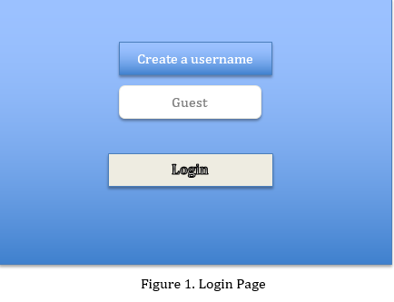
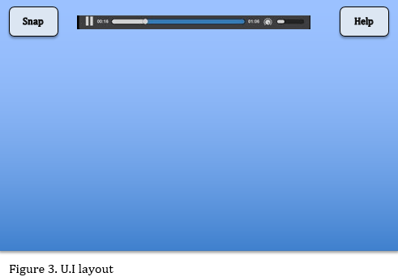

>JD: Overall, a good start.  Please review the document for any "shall, will, should, may, must, can, etc.", these all imply a requirement, and there are numerous misses throughout the document. Many of the requirements are placed on the user.  Also, as noted below, section 3 and 4 are the guts of the document and need detail.  I love the MD format, by the way.

## 1. Introduction

### 1.1 Purpose 
The purpose of this document is to provide a detailed requirements overview for the Griffin Chess application. It will also explain the purpose and features. Griffin Chess shall provide the user with a reliable, well designed chess game. The version of this product is 1.0 and this SRS shall cover the full scope of the chess game.

### 1.2 Document Conventions
* Acronyms
  * GC: Griffin Chess
  * IDE: Integrated Development Environment

### 1.3 Product Scope
> JD: I would expect you can launch it without an IDE, and just the JRE.   You can also put the github URL here

Griffin Chess is developed entirely in Java and can be launched on a system that supports the JRE. This entire project will be available on GitHub.

### 1.4 References
“Laws of Chess: For competitions starting before 1 July 2014.” World Chess Federation - FIDE, www.fide.com/component/handbook/?id=124&view=article.

## 2. Overall Description

### 2.1 Product Perspective
> JD: "The user can" sounds a lot like a requirement.  Rewrite to put the requirement on the system.  "The system allows" is closer, but still not quite right.  Remember, you are setting out requirements (rules) here for the game itself.

The product is a java based stand alone application for a Chess game. The system provides simple mechanism for users to play against an opponent in a game of chess.
The following are the main features that are included in the game.
1/2 player: The user can play against the computer, or against a second player.
Difficulty: If playing 1-player, the user can select varying AI difficulty
User account: The system allows the user to create their accounts in the system, along with profile view.
Tips/How to play: A section that includes an explanation of the basic rules of chess, along with some tips to get the user started.

### 2.2 Product Functions
> JD: "Let the user" -> make this a clear system requirement.  "(if it's one of the features we'll implement)" -> Just make it a requirement.  If you don't get it implemented, that's fine, you just don't get an extra point in that section for it.  For now we will assume you will try to do them all.

Let the user choose options from a menu, which are: 
   Single player -> Start a game of chess against a computer: Difficulty selection is also available here
   Two-player (if it's one of the features we'll implement) -> Start a game of chess with two players
   Account -> Let user see their account info (history/settings/scores/etc)
   Tips/How to play -> display a list of tips/how-to-play manual
 

### 2.3 User Classes and Characteristics
> JD: I like that you will be providing instruction to the user, so a novice to chess can play.  You might want to clarify the first sentence though.  Not _ANY_ computer will work...

The expected user simply is anyone with access to a computer. There are no privilege levels/educational level/expertise nor experience required. The user is not expected to know Chess, as the rules and tips/strategies will be included in the application.

### 2.4 Operating Environment
> JD: Which Java version?  You need to set a minimum.

This will be a Java based application, so the user must have installed the Java environment in their computer. 

### 2.5 User Documentation
> JD: A section of what?  If you do have bug workarounds, just let me know when you submit the papers/code (which will be a repo clone, btw).

A section with the Chess rules will be included, along with some initial basic tips to give the user a good idea on how to start playing chess. 
(Aside, in case there are any bugs that were not able to be fixed at time of product delivery, perhaps to include and list of possible workarounds?)

### 2.6 Assumptions and Dependencies
Since this will be a standalone application, there will not be any other dependencies aside the requirement of having the Java environment installed in the computer. 

## 3. External Interface Requirements

### 3.1 User Interfaces
> JD: So this is where SRSes can get tricky.  Indicating Java as a requirement is fine, since the customer might actually do that. Customers might want the portability of Java (which you haven't really indicated as a reason), and so ask for it specifically.  However, customers probably won't tell you that they need you to use Swing.  That means its a design detail that should be in the SDD.  If you think there might be some valid reason a user might specify Swing specifically, put it in here.

The game will provide users with a graphical interface (GUI) and will be controlled via the mouse and keyboard. The graphical elements will be built upon the components provided by the Java Swing framework. The game graphics will be created using Swing and the chess pieces will be based on vector images provided by _uidownload.com_.

> JD: "Users will" -> rewrite to put the requirement on the game

Using the mouse, users will be able to navigate the game's main menu and adjust settings by clicking on a variety of buttons, like the ones **pictured below**. The user can begin a new game of chess by clicking on the "Start Game" button.

> JD: Lots of requirements are hidden in here that need to be made explicit.  I.e. "The game shall show a top down view..", and "The game shall allow a user to select a piece by clicking"...  Instead of a paragraph of text, break these each out.  Use a bulleted list or something similar.  Also, try to be more specific/add detail.  How does the piece become highlighted?  Consider corner/negative cases: What happens if the user clicks an invalid square, etc.  To me, this is the guts of the document, and it needs to be detailed.  This is the part the user would really care about.

Once a game has begun, the user will be shown a top down view of a chessboard with all of the pieces on it. On their turn a user can select a piece by clicking on it, which will cause it to become highlighted. Once a piece has been selected the user can click on a space to select it as a target/destination. If this space can be reached through a valid move, the square on the board will become highlighted, and a "Confirm" button will become enabled. If the user confirms their move, an animation will be displayed of the piece moving to its new location, overtaking any pieces that might currently occupy that space. The other player, whether computer or human, will take their move, and the two players will continue until one wins or forfeits. A screen will be displayed at the end of the game, summarizing the match.

### 3.2 Hardware Interfaces
>JD: You still need a mouse and monitor, I assume?  Keyboard?  Speakers?

Since our game will be written in Java, which is executed in a virtual machine, we will not need to interface directly with any hardware. Any type of hardware that is able to run and support the JVM should be able to run the executable JAR files for this game.

### 3.3 Software Interfaces
>JD: This section isn't needed unless you are communicating with other software.  You could argue that you interface with the JVM, but its not really relevant to the user.  What you have here is SDD stuff.

While the user will interact with the game through the GUI front end, the core mechanics will be operating in a loosely coupled back-end and will follow a Model-View-Controller pattern. The game state, logic, and user interactions will be kept separate from the classes that display them, which will allow us to offer users different display options in the future and will allow the teams to write more maintainable, encapsulated code.

## 4. System Features

### 4.1 Greeting User Interface
> JD: A login... hmm, what will this be used for?  This is the only time you mention it.

4.1.1 Description
When the user runs the program, a login interface shall be greeted to create a username for the chess game in the input field. The default username is Guest if no username is entered. 
The interface shall also provide an option button for a second player or computer opponent after the first user name is created. The game of chess shall consist of two different players in the game. 
1. Player / Guest 
2. Computer A.I 

### 4.2 Difficulty level 
4.2.1 Description
The greeting interface should allow the user to change the difficulty level of the A.I opponent. In figure 2, Shows there should be three levels of difficulty, easy, medium, and hard. The default level will be easy. Hard difficulty will maximize the A.I. efficiency to win the game.  

### 4.3 Game Rules / Beginner help FAQ 
4.3.1 Description
As shown in Figure 3, when the user is in the game, a button in the right top corner of the UI window during the game when clicked should open a page with the Griffin Game of Chess rules. The rule FAQ should open a link or list of official chest rules to play Griffin Chess. 

### 4.4 Music Player
>JD: Interesting and cool idea.  However you really don't say anything about how this will work?  User can not add music?  Will you only play music that ships with the game? How do I bring up the player controls?  Please add detail

4.4.1 Description
While in game is in progress, the user should be able to play music from the embedded music player as shown in Figure 3. The user should not be allowed to add music tracks. The music player will contain the default play/pause, and skip functions for the ease of control of the player.  

### 4.5 Day/Night Mode
4.5.1 Description
>JD: Good idea, a picture would help a lot here.  How does the user access this?  Please detail.

The overall U.I theme should be able to change for the comfort of the user due to eyestrain. The default theme when Griffin Chess opens is the day mode U.I. The colors for day mode are visibly brighter for use in bright conditions. Night mode changes the U.I colors to visibly darker colors to decrease the chance of eyestrain. The user should have the option to toggle between either day or night mode while in progress of the game. 

### 4.6 Save Screenshot 
4.6.1 Description
>JD: Good idea, but won't the OS default screen capture work?  Please add some detail anyhow, what button will the user click, how will they be able to download a screenshot?  Also, this isn't a web based application, so.. isn't downloading the wrong term?

While in progress of the game, the user should have a button to click for a screenshot of the game window. This screenshot could then be downloaded if the user wants. 

### 4.7 Interactive Game Moves
4.7.1 Description
The user should be shown the possible move outcomes with the piece that is chosen. The intergraded A.I should help with the outcomes regardless if there is a human or A.I opponent. The U.I should display a notification on the board to interact with the user. If a move has the outcome of a piece capture, the U.I will display a ‘X’ over the piece that will be captured.

## 5. Other Nonfunctional Requirements

### 5.1 Performance Requirements  
The program shall not crash. Other than that, there are not any specific performance requirements. The time complexity and space complexity have not been specified. The overall goal is to get the program running without any bugs or user-related problems.

### 5.2 Safety Requirements  
There are no safety requirements.

### 5.3 Security Requirements  
There are no security requirements. The program has no database, no user information, or any private information that could be used to compromise an individual.

### 5.4 Software Quality Attributes  
The program shall run smoothly and give the user a somewhat enjoyable experience playing chess at a basic level.

### 5.5 Business Rules  
There are no business rules.
